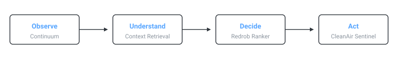

# Aditya Gayal

**Developer tools · Backend systems · Applied AI**

I build systems that turn opaque AI-assisted decisions into observable, testable, and actionable workflows.

Currently building **Continuum**, a local-first observability system for coding agents.

[Continuum](#what-i-am-building-now) · [LinkedIn](https://linkedin.com/in/aditya-gayal) · [Email](mailto:gayaladitya9@gmail.com)

---

   Understand -> Decide -> Act mapping to Continuum, Context Retrieval, Redrob Ranker, and CleanAir Sentinel">

## What I am building now

My primary focus is **Continuum**: infrastructure for observing how AI coding agents use repository context. 

The current work is moving beyond run logging toward context compilation, evidence provenance, and reproducible agent comparisons. The goal is to make it possible to answer not only “did the agent succeed?” but also “what evidence did it use, what was inferred, and what changed the outcome?”

*Current focus — July 2026* · [Explore the repository](https://github.com/AntiDynamic/Continuum)

## The systems

### Continuum — Evidence for coding-agent behaviour
AI coding tools can produce a patch without explaining which repository context shaped it. Continuum records externally observable run evidence, builds retrievable repository context, and exposes it through MCP.
TypeScript · SQLite/FTS5 · MCP · Agent observability
[Explore the repository](https://github.com/AntiDynamic/Continuum)

### EvidenceGraph / Redrob Ranker — Deterministic candidate evaluation
Evaluating resumes using LLMs introduces non-deterministic hallucinations. This CPU-only ranking engine processes candidate histories locally and generates traceable, grounded reasoning for every score without relying on a network connection.
Python · Deterministic Scoring · Local-first
[Explore the repository](https://github.com/AntiDynamic/redrob-ranker)

### CleanAir Sentinel — Converting civic reports into action
Environmental reporting often generates unstructured noise. This backend system ingests, categorizes, and validates reports into actionable workflows that degrade honestly when external APIs fail.
FastAPI · Workflow Automation

## Engineering in practice

* **Cross-platform CI:** Continuum is exercised across Ubuntu and Windows on multiple supported Node versions.
* **Reproducible benchmarks:** Redrob Ranker's 100K-profile throughput is measured locally without network variance.
* **Database migrations:** Schema evolution in Continuum is handled through versioned SQLite migrations.
* **Local inference:** Systems prioritize running locally to eliminate latency and protect sensitive context.

## How I approach engineering

* **Observable over magical:** AI outputs should include enough evidence to understand how the result was produced.
* **Deterministic where possible:** Ranking, evaluation, and system boundaries should not become probabilistic merely because AI is involved.
* **Honest degradation:** When a model, API, or dataset is unavailable, the product should disclose uncertainty instead of generating fake certainty.
* **Measure before claiming:** Performance, accuracy, and reliability statements require reproducible evidence.

## Open problems and collaboration

I am interested in repository-context retrieval, coding-agent evaluation, and systems that keep AI-generated decisions traceable. Continuum has open work around retrieval quality, adapter support, and reproducible comparison protocols.

If you are exploring local-first AI infrastructure or deterministic decision engines, I would love to connect.

[View open issues](https://github.com/AntiDynamic/Continuum/issues)